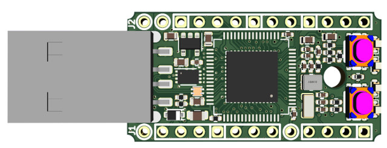

# pybstick-projects

Ce GitHub regroupe un ensemble de projets de démonstration MicroPython articulés autour de la [carte PYBStick](https://shop.mchobby.be/fr/micropython/1830-pybstick-lite-26-micropython-et-arduino-3232100018303-garatronic.html) produite par Garatronic.

La __documentation MicroPython de la PYBStick__ est disponible dans le dépôt [pyboard-driver/PYBStick](https://github.com/mchobby/pyboard-driver/tree/master/PYBStick)

Voici la liste des projets disponibles, voir les détails des différents projects dans leur sous-répertories respectifs.

* __[copy-paste](../../tree/master/copy-paste)__ : réaliser des touches copier/coller pour compléter un clavier.
* __[keybow](../../tree/master/keybow)__ : une version avancée du projet [copy-paste](../../tree/master/copy-paste) exploitant un KeyBow de Pimoroni.
* __[oled-stat](../../tree/master/oled-stat)__ : Affichage taille du système de fichier et RAM disponible sur écran OLED.
* __[covid-madenn-timer](../../tree/master/covid-madenn-timer)__ : Minuteur automatique pour le lavage des mains (inspiré de Madenn Nunten)
* __[tooth-brushing-timer](../../tree/master/tooth-brushing-timer)__ : Minuteur de brossage de dents (inspiré de Madenn Nunten)
* __[zumo](../../tree/master/zumo)__ : PYBStick sur chenilles avec un capteur de distance HC-SR04
