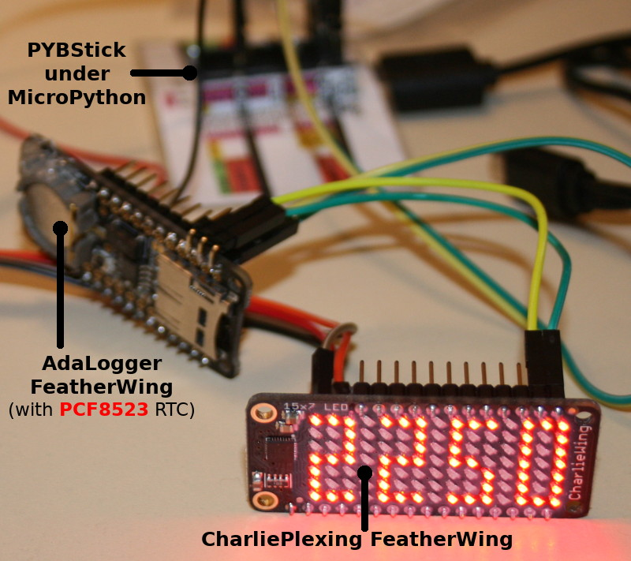
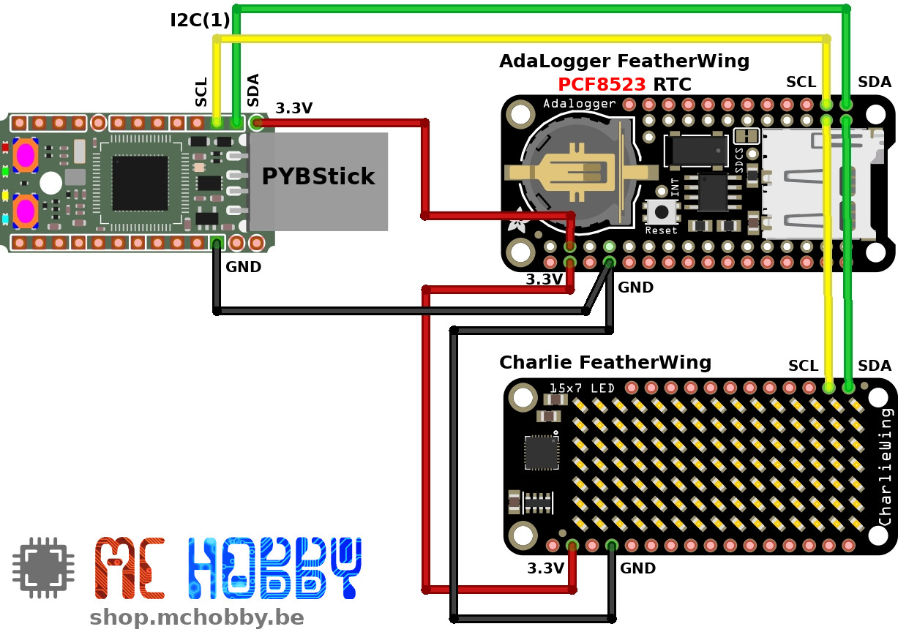
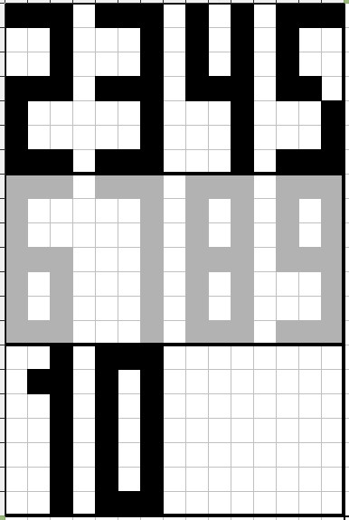
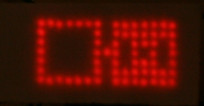
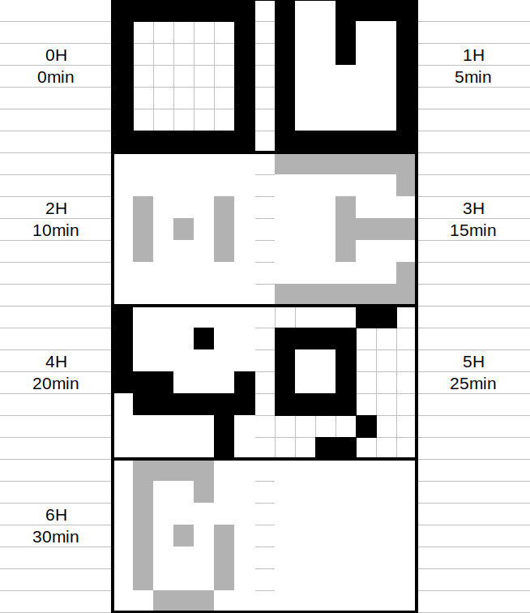
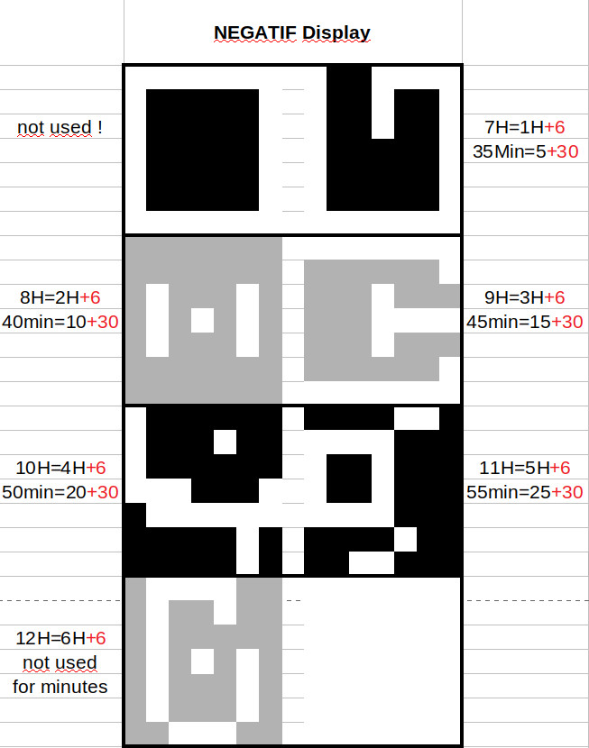

# Créer une mini horloge compacte sur une matrice CharliePlexing de 15x7 caractères.

Ce projet propose de créer une petite horloge compacte avec un affichage LED.

L'image ci-dessous présente le prototype réaliser à partir d'une [PYBStick Standard](https://shop.mchobby.be/fr/micropython/1844-pybstick-standard-26-micropython-et-arduino-3232100018440-garatronic.html), un [FeatherWing Adalogger](https://shop.mchobby.be/fr/feather-adafruit/1056-adalogger-featherwing-rtc-pcf8523-microsd-3232100010567-adafruit.html) (pour avoir une horloge RTC PCF8523) et une [matrice CharliePlexing FeatherWing](https://shop.mchobby.be/fr/feather-adafruit/1563-featherwing-matrice-led-15x7-en-charlieplexing-pour-feather-3232100015630-adafruit.html).



Cet afficheur utilise un Featherwing CharliePlexing d'Adafruit dont il est possible de contrôler la luminosité de chaque LED.

Cette matrice permettra de réaliser une horloge dont il est possible de contrôler la luminosité... idéal pour une utilisation de nuit.

## Origine du projet:
A la base de ce projet se trouve une irritante contradiction.

__Un:__ je n'aime pas de réveil car il éclaire la pièce durant la nuit.

__Deux:__ se réveiller en pleine nuit ne permet pas de savoir quelle heure il est, ce qui est parfois frustrant.

__Solution:__ Avoir un tout petit réveil, éteint en temps normal mais qui s'allume à faible intensité pendant 30 secondes lorsque l'on tapote dessus.

Il faut donc commencer par créer ce dit réveil (ou horloge) avant de le personnaliser... c'est ce que propose ce dépôt

# Brancher



# Bibliothèque
Ce projet exploite les bibliothèques `pcf8523` et `is31fl3731` (disponibles dans l'archive présente dans le sous-répertoire `lib`).

Une petite bibliothèque complémentaire `fcharlie.py` combine le pilote `CharlieWing` avec un FrameBuffer MicroPython.

Ces bibliothèques (et exemples correspondants) sont disponibles sur les dépôts suivants:
* [Dépôt is31fl](https://github.com/mchobby/esp8266-upy/tree/master/is31fl)
* [Dépôt pcf8523](https://github.com/mchobby/esp8266-upy/tree/master/pcf8523)

Les bibliothèques suivantes doivent être copiées sur la carte MicroPython:
* `pcf8523`
* `is31fl3731`
* `fcharlie.py`

# Fixer l'heure de l'Horloge

Si votre Horloge RTC n'est pas encore initialisée alors insérez une pile bouton puis saisir les lignes suivantes pour initialiser l'heure de la RTC.

```
from machine import I2C
from pcf8523 import PCF8523
import time

# PYBStick - S3=sda, S5scl
i2c = I2C(1)

rtc = PCF8523( i2c )

# Utiliser la date et heure du jour...
# Année: 2020, Mois: 6, Jour: 22, Heure: 0, Min: 14, Sec: 6, Jour de la semaine: 0 (lundi), jour de l'année: 174
rtc.datetime = (2020, 6, 22, 0, 14, 6, 0, 174)
```

Vous trouverez également ces lignes dans le script `setdate.py` présent dans ce dépôt.

# Tester

Pour tester le projet, il faut copier le `clock.py` sur la carte MicroPython (ou dans  le fichier `main.py` pour un démarrage automatique).

Le script peut-être démarré depuis une session REPL avec l'intruction `import clock` .

Le corps du script, repris ci-dessous, est abondamment documenté pour une meilleure compréhension.

__Note:__
* L'afficheur CharliePlex est normalement contrôlé à l'aide de la classe `is31fl3731.CharliePlex`. Dans ce projet l'afficheur est pris en charge par la classe `ClockCharlie`.
* La classe `ClockCharlie` prend en charge un `FrameBuffer` MicroPython ainsi que l'affichage des digits (0..9) de l'horloge sur une position donnée de la matrice (0..3, soit 4 chiffres).
* Un point séparateur clignote sur la colonne centrale de l'afficheur, à raison d'une fois toutes les 2 secondes. Ce point débute sa progression en haut de la colonne au début de chaque minute et progresse lentement vers le bas au fur et a mesure que les secondes s'égrainent.

```
# Création du bus I2C, sur PYBStick - S3=sda, S5scl
i2c = I2C(1)
rtc = PCF8523( i2c )      # Horloge RTC
disp= ClockCharlie( i2c ) # Afficheur

# L'afficheur dispose de 8 frames, ce qui signifie qu'il est possible de remplir
# un frame (ex: n° 1) pendant qu'un autre frame est affiché (ex: 0).
# Cela évite le désagréable l'effet Flickering où l'afficheur est rafraîchit
# pendant la modification du contenu du Frame.
frame = 0

while True:
	# Heure de la RTC (sous forme de secondes)
	_now = rtc.datetime

	# Décodage de l'heure. Retourne un tuple ( Année, Mois, Jour, Heure,
	#	  Min, Sec, Jour_de_la_semaine, Jour_de_l_annee )
	_dt  = time.localtime(_now)

	# Obtenir Heure, Minutes et secondes
	hh = _dt[3]
	mm = _dt[4]
	ss = _dt[5]

	# Effacer le contenu du Frame Buffer
	disp.clear()

	# Afficher l'heure en 4 positions
	disp.draw_digit( hh//10, 0 ) # Heures - Chiffre de la dizaine
	disp.draw_digit( hh%10 , 1 ) # Heures - Chiffre de l'unité
	disp.draw_digit( mm//10, 2 ) # Minutes - Chiffre de la dizaine
	disp.draw_digit( mm%10 , 3 ) # Minutes - Chiffre de l'unité

	# Faire clignoter un pixel toutes les secondes (1 seconde allumée,
	#    1 seconde éteinte). La division modulaire par 2 (%2) retourne la
	#    valeur 1 une seconde sur deux.
	# Le pixel descent le long de la colonne durant
	#    l'écoulement de la minute ss=0 -> ss//9=0, ss=59 -> ss//9=6
	disp.fb.pixel( 7, ss//9, (ss%2 == 1) )

	# Envoyer le contenu du FrameBuffer vers l'afficheur + affichage
	disp.clear_frame( frame ) # efface le contenu du frame
	disp.paint_frame( frame, show=True )

	# Alterner vers l'autre frame pour le remplissage suivant
	frame = 0 if frame else 1
```

# Notes
## Encodage de la Font

Pour pouvoir afficher 4 chiffres sur une matrice 15x7, il faut que chaque caractères (chiffres de 0 à 9) soit composé de 3 colonnes de 7 pixels de haut.

Les différents chiffres présentés sur l'image ci-dessous sont déjà arrangés dans une matrice 15x7 pixels.



Dans la définition du la variable `font`, le caractère 0 est encodé comme suit:

```
font = { 0: [0b01111111,0b01000001,0b01111111],
	...
 }
```
Soit, l'arrangement de 3 lignes (pour les 3 colonnes):
```
Col 1 -> 0b01111111 -> .*******
Col 2 -> 0b01000001 -> .*.....*
Col 3 -> 0b01111111 -> .*******
```

A noter que:
* Le bit le plus à droite correspond au haut de la colonne.
* Seuls les 7 bits de poids faibles sont utilisés puisque l'écran fait 7 lignes de haut.

## Alien clock

Le script `alien.py` est un exemple de reconversion du projet d'horloge.

Celle-ci utilise deux glyphs pour afficher l'heure et les minutes (par tranche de 5 minutes).



La ligne centrale bat les secondes et progresse le long de la colonne pendant l'écoulement des 5 minutes.

Voici la codification employée dans cet exemple.





# Liste d'achat
* Une carte [PYBStick Standard](https://shop.mchobby.be/fr/micropython/1844-pybstick-standard-26-micropython-et-arduino-3232100018440-garatronic.html)
* Un [FeatherWing Adalogger](https://shop.mchobby.be/fr/feather-adafruit/1056-adalogger-featherwing-rtc-pcf8523-microsd-3232100010567-adafruit.html) pour avoir une horloge RTC PCF8523 -OU- un [module PCF8523](https://shop.mchobby.be/fr/pi-extensions/1148-pirtc-pcf8523-real-time-clock-for-raspberry-pi-3232100011489-adafruit.html)  
* Une [matrice CharliePlexing FeatherWing](https://shop.mchobby.be/fr/feather-adafruit/1563-featherwing-matrice-led-15x7-en-charlieplexing-pour-feather-3232100015630-adafruit.html).
