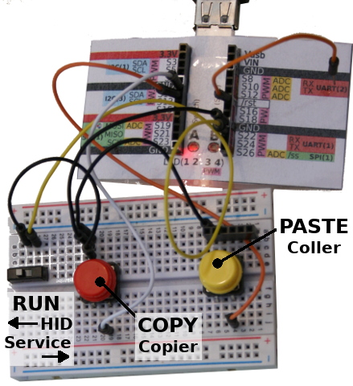
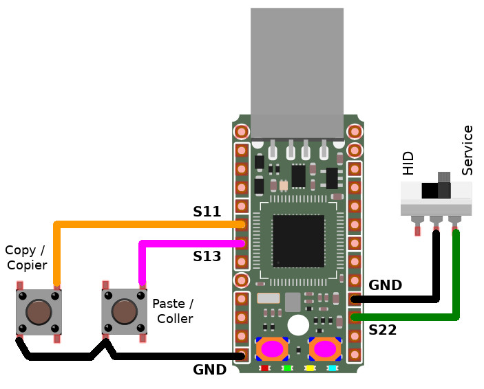

# Copier-Coller
Ce projet propose de créer un petit clavier d'appoint (périphérique USB) avec des touches copier / coller en simulant ce CTRL-C et CTRL-V.

Deux boutons seront utilisés en guise de touche et un petit interrupteur permettra de choisir entre le mode clavier ou maintenance au moment de la mise sous tension.

Le mode maintenance permet:
* de retrouver une carte MicroPython fonctionnelle (stockage de masse et port serie)
* de modifier le script `keyb.py` pour ajouter plus de boutons ou d'autres opérations claviers.

# Brancher
Le schéma de raccordement est relativement simple:

# Dépendance
Pour fonctionner, ce projet requière l'installation des bibliothèques suivantes sur la carte MicroPython.

* [usbid](https://github.com/mchobby/pyboard-driver/tree/master/usbhid) : facilitant l'usage de clavier Azerty. Les fichier `usbhid.py` et `kmap_frbe.py` seront nécessaires.

# Installer

Pour faire fonctionner cet exemple, il est nécessaire de copier les fichiers suivants sur la carte:

* `boot.py` : configure la PYBStick comme périphérique HID (peut être désactivé en placant le bouton sur la position arrêt avant la mise sous tension de la PYBStick)
* `keyb.py` : contient le script principal détectant la pression des boutons et envoyant les combinaisons de touche vers l'ordinateur
* `nomain.py` : est exécuté en mode service

# Mise en route
Placer le bouton en mode HID (pas de mise à la masse) puis redémarrez votre PYBStick:
* Soit un fil mettant en contact /rst et GND
* Soit en débranchant et rebranchant la clé

Une fois le script démarré, la LED rouge s'allume sur la PYBStick.
Si la LED bleue s'allume, cela signifie qu'il y a eu une erreur durant l'exécution du script.

__!!! IMPORTANT !!!__ aucune session terminal/repl doit être ouverte sur la carte MicroPython au moment du redémarrage. Cela perturbe l'activation du mode HID et se traduit par un clignotement en alternance de la LED rouge et LED bleue (erreur système MicroPython).

# Où acheter
* [PYBStick 26 lite  @ MCHobby](https://shop.mchobby.be/fr/micropython/1830-pybstick-lite-26-micropython-et-arduino-3232100018303-garatronic.html)
* [Gamme MicroPython chez MCHobby](https://shop.mchobby.be/fr/56-micropython)
