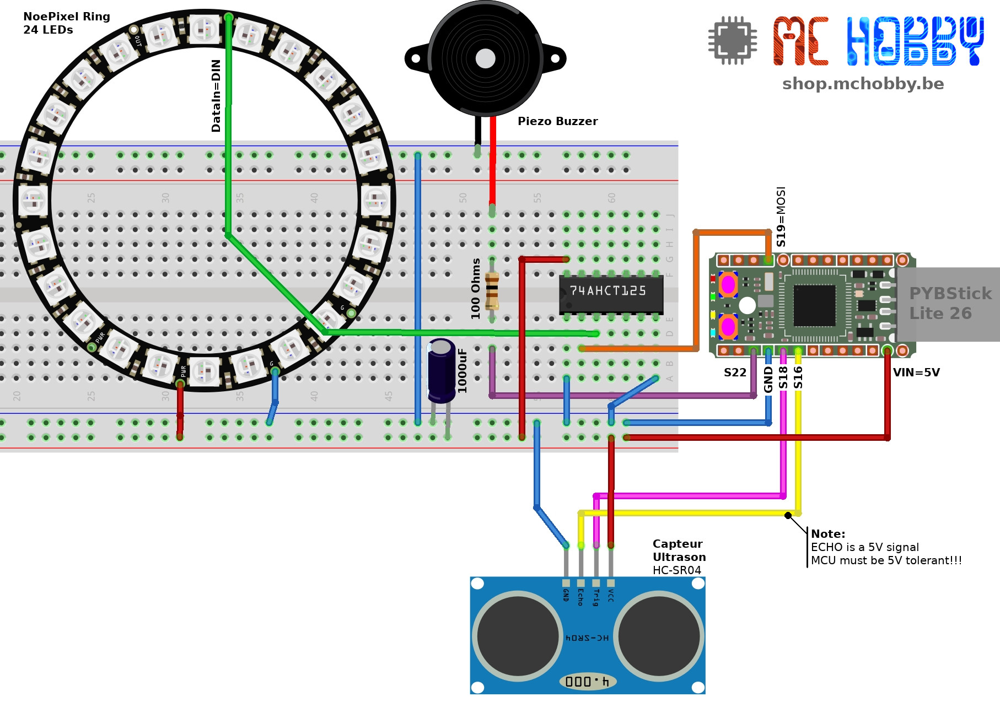

# Minuteur automatique pour le lavage des mains

Ce projet est inspiré de l'idée de [Madenn Nunten qui du haut de ses 10 ans a réaliser un minuteur à l'aide d'Arduino](http://madenn.space/minuteur-automatique-pour-lavage-mains), quelques LEDs un Piezo Buzzer et capteur Ultrasonique.

Une grande idée en cette période de Covid-19 revisitée avec MicroPython et la PYBStick.

Ce projet peut être vu en cours de fonctionnement dans [cette Video Youtube](https://youtu.be/C3G3JJ85YiM).

Il faudra encore lui trouver une jolie boîte.

# Principe de fonctionnement
1. Le minuteur s'active en passant la main devant le capteur.
2. Une fois en route, la roue se remplit pendant 4 seconde, le temps nécessaire pour prendre du savon.
3. Ensuite, le décompte de 40 secondes commence, temps pendant lequels l'anneau s'éteind progressivement.
4. Au bout des 40 secondes, l'anneau s'éteint et le buzzer signal la fin du nettoyage.
5. Voila, il est temps de se sécher les mains. Le minuteur est près pour un nouveau cycle.

# Brancher
Le schéma de raccordement n'est pas trop difficile. Un adaptateur de 74AHCT125 est utilisé pour pouvoir utiliser exploiter les NeoPixels sous 5V et offrir des couleurs vives.

# Dépendance
Pour fonctionner, ce projet requière l'installation des bibliothèques suivantes sur la carte MicroPython.

* __ws2812.py__ : contrôler des NeoPixels avec le bus SPI [disponible ici (esp8266-upy GitHub)](https://github.com/mchobby/esp8266-upy/tree/master/neopixel)
* __ultrasonic.py__ : mesure de distance avec un capteur ultrason HC-SR04 [disponible ici (pyboard-a-roulette)](https://github.com/mchobby/pyboard-a-roulette/tree/master/libraries/ultrasonic)

# Installer
Pour faire fonctionner cet exemple, il est nécessaire de copier les fichiers suivants sur la carte:

* `madenn.py` : contient le script principal. Il doit être renommé `main.py` pour démarrer automatiquement à la mise sous tension de ma carte.

Il est également possible de tester le script `madenn.py` depuis une session REPL en saisissant la commande suivante:

`import  madenn`

# Liste d'achat
* [PYBStick 26 @ MCHobby](https://shop.mchobby.be/fr/micropython/1830-pybstick-lite-26-micropython-et-arduino-3232100018303-garatronic.html) (ou carte [MicroPython](https://shop.mchobby.be/fr/56-micropython))
* [Anneau NeoPixel 24 LEDs](https://shop.mchobby.be/fr/neopixels-et-dotstar/405-anneau-neopixel-24-leds-rgb--3232100004054-adafruit.html)
* [Anneau NeoPixel - 24 LEDs RGB](https://shop.mchobby.be/fr/neopixels-et-dotstar/405-anneau-neopixel-24-leds-rgb--3232100004054-adafruit.html)
* [Capteur distance ultrason - HC-SR04](https://shop.mchobby.be/fr/proximite-distance/561-capteur-distance-ultrason-hc-sr04-3232100005617.html)
* [Piezo Buzzer](https://shop.mchobby.be/fr/autres-capteurs/57-piezo-buzzer-3232100000575.html)
