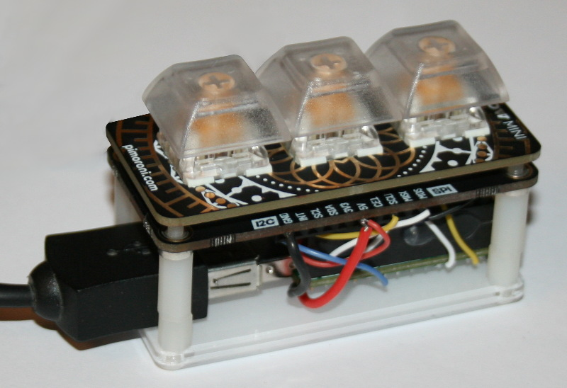
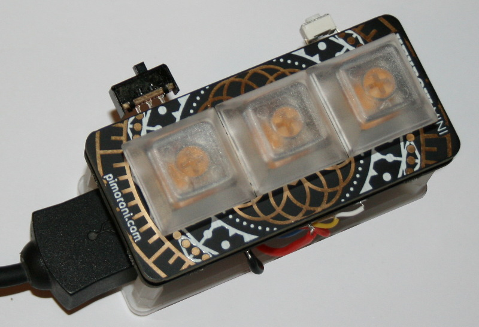
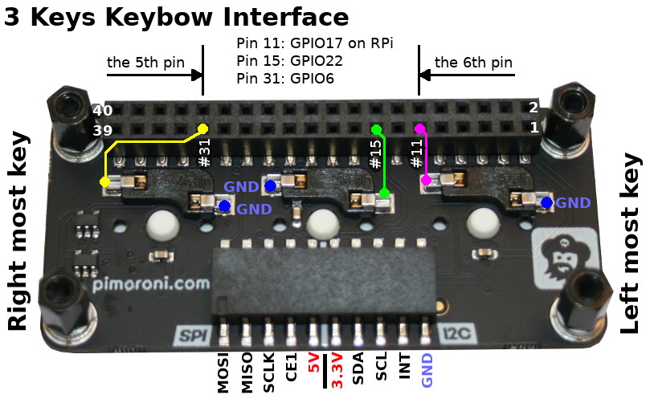
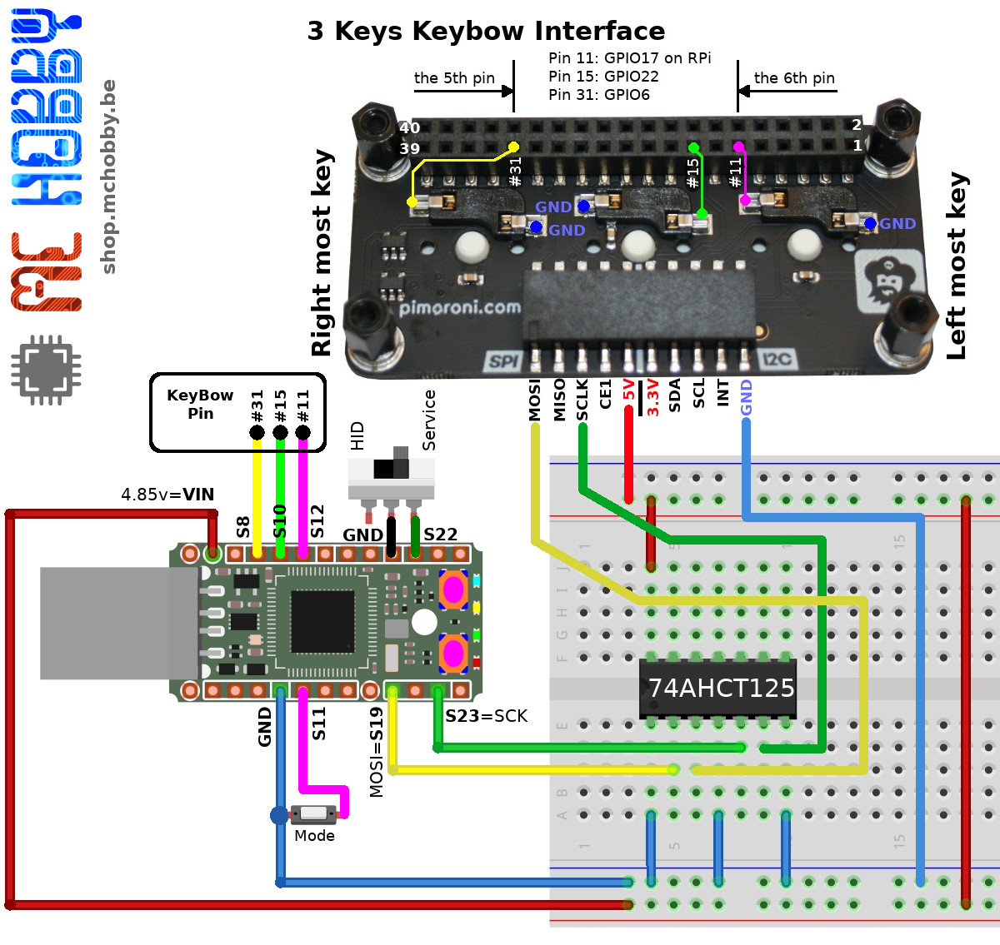

# Pimoroni Keybow support avec MicroPython
Ce projet est une amélioration du projet copy-paste (copier/coller) utilisant les claviers Keybow de Pimoroni.



Les claviers Pyboard utilise des touches Cherry-MX (branchées sur les GPIOs du Pi) et des __LEDs RGB__ sous les touches contrôlables individuellement (DotStart/APA102 via le bus SPI).



Un petit interrupteur permettra de choisir entre le mode clavier (HID) ou maintenance (Service) au moment de la mise sous tension.

Le bouton Mode permet de changer le type de raccourcis utiliser:
* Copier/coller (couleur rouge)
* Copier/Coller terminal (couleur vert)
* etc

Le mode maintenance permet:
* de retrouver une carte MicroPython fonctionnelle (stockage de masse et port serie)
* de modifier le script `keybow3.py` pour modifier les opérations du clavier.

# Brancher
Détail électrique du KeyBow.



Le schéma de raccordement est relativement simple:



Les boutons mode et switch (HID,Service) ont été soudés sur le GPIO en prenant soin d'utiliser des Masses présentes sur le GPIO (et sans créer de CC avec les broches d'alimentation). Il est néanmoins possible  d'opter pour d'autres méthodes de fixation.

# Dépendance
Pour fonctionner, ce projet requière l'installation des bibliothèques suivantes sur la carte MicroPython.

* [usbid](https://github.com/mchobby/pyboard-driver/tree/master/usbhid) : facilitant l'usage de clavier Azerty. Les fichier `usbhid.py` et `kmap_frbe.py` seront nécessaires.
* [dotstar.py](https://github.com/mchobby/esp8266-upy/tree/master/dotstar) : pour commander des LEDs APA102 aussi connue sous le nom de DotStar (basé sur [micropython-dotstar](https://github.com/mattytrentini/micropython-dotstar) __mais optimisé__ pour consommer moins de RAM au parsing et à l'exécution).

# Installer

Pour faire fonctionner cet exemple, il est nécessaire de copier les fichiers suivants sur la carte:

* `boot.py` : configure la PYBStick comme périphérique HID (peut être désactivé en placant le bouton sur la position arrêt avant la mise sous tension de la PYBStick)
* `keybow3.py` : contient le script principal pour le Keybow 3 touches (détectant la pression des boutons et envoyant les combinaisons de touche vers l'ordinateur)
* `nomain.py` : est exécuté en mode service

# Mise en route
Placer le bouton en mode HID (pas de mise à la masse) puis redémarrez votre PYBStick en débranchant et rebranchant la clé.

Une fois le script démarré, la LED rouge s'allume sur la PYBStick et les touches deviennent rouge (mode 0).
Si la LED bleue de la PYBStick s'allume, cela signifie qu'il y a eu une erreur durant l'exécution du script.

__!!! IMPORTANT !!!__ aucune session terminal/repl doit être ouverte sur la carte MicroPython au moment du redémarrage. Cela perturbe l'activation du mode HID et se traduit par un clignotement en alternance de la LED rouge et LED bleue (erreur système MicroPython).

Pour configurer les touches, chercher la définition de `configs` dans `keybow3.py`, tels que présenté ci-dessous.
```
# Association de Mode -> Couleur bouton + définition des touches
configs = {
   0: { 'color':(64,0,0), # Couleur rouge pour les boutons KeyBow
        'keys' : [ (btn_left  , 'c', [CTRL] ), # Association bouton -> touche + modifiers
                   (btn_middle, 'v', [CTRL] ),
                   (btn_right , 'a', [CTRL] ) ]
       },
   1: { 'color':(0,64,0), # Couleur verte pour les boutons KeyBow (pour terminal Linux)
        'keys' : [ (btn_left  , 'c', [CTRL_RIGHT,SHIFT_RIGHT] ),
                   (btn_middle, 'v', [CTRL_RIGHT,SHIFT_RIGHT] ),
                   (btn_right , 'v', [CTRL] )    ]
       }
}
```

# Amélioration
Ce projet peut être amélioré de diverses façons:
* détecter des combinaisons de touches sur le Keybow (pour offrir plus de possibilités).
* permettre la saisie de séquences complexes ex: SHIFT+CTRL+u 2126 ENTER pour saisir le caractère Unicode Ω (Oméga, sous Unix).
* utiliser un KeyBow 12 touches + développer un carte d'interface.

# Où acheter
* [PYBStick 26 lite  @ MCHobby](https://shop.mchobby.be/fr/micropython/1830-pybstick-lite-26-micropython-et-arduino-3232100018303-garatronic.html)
* [Gamme MicroPython chez MCHobby](https://shop.mchobby.be/fr/56-micropython)
* [KeyBow 3 touches @ MCHobby](https://shop.mchobby.be/fr/pi-extensions/1832-keybow-3-touches-kit-cliky-pour-raspberry-pi-3232100018235-pimoroni.html)
* [KeyBow @ Pimoroni](https://shop.pimoroni.com/?q=keybow+)
