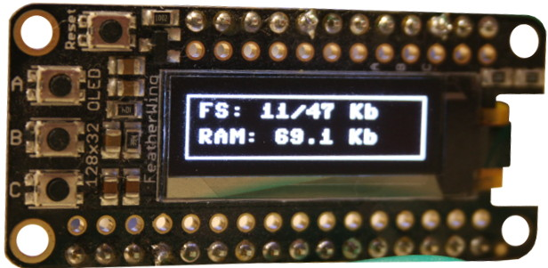
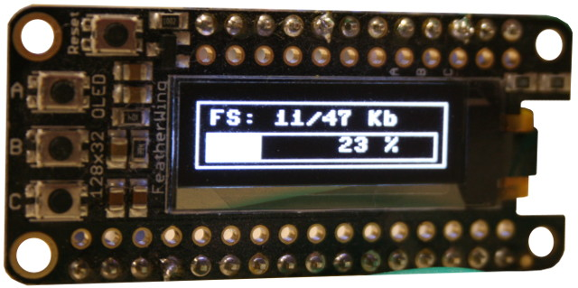

# oled-stat - Affichage de statistique sur un écran OLED

Ce projet propose d'afficher des statistiques de la carte MicroPython sur un afficheur OLED 128x32.

Ce projet affiche:
* L'espace disque disponible dans la mémoire Flash.
* La RAM disponible



L'afficheur OLED utilisée est basé sur le pilote SSD1306 sur bus I2C (signaux SDA et SCL). Celui-ci est exploité sur de très nombreux produits comme le [Oled Feather Wing d'Adafruit](https://shop.mchobby.be/product.php?id_product=879). Ce dernier est une ressource fiable et est par ailleurs très facile à se procurer.

# Brancher
Le schéma de raccordement est relativement simple:


Les boutons A, B et C sont respectivement branchés sur S11, S13, S15.
Ces connexions ne sont pas utilisées dans l'exemple, vous pouvez donc les ignorers.

# Dépendance
Pour fonctionner, ce projet requière l'installation des bibliothèques suivantes sur la carte MicroPython.

* [ssd1306](https://raw.githubusercontent.com/micropython/micropython/master/drivers/display/ssd1306.py) : Pilote SSD1306 officiel de MicroPython.<br />L'utilisation de cette bibliothèque est décrite en détail sur [le wiki de MCHobby](https://wiki.mchobby.be/index.php?title=FEATHER-MICROPYTHON-OLED)

# Installer

Pour faire fonctionner ce projet, il est nécessaire de copier les fichiers suivants sur la carte:

* `stat.py` : contient le script principal affichant les statistiques sur l'afficheur OLED.

# Utiliser

Importer le module initialise l'afficheur et présente, une première fois, l'état du système de fichier puis de de la RAM (1 seconde plus tard).

Il est très facile de tester cet exemple en réalisant une importation à la volée `import stat` depuis une session REPL.

```
MicroPython v1.12-256-geae495a-dirty on 2020-03-18; PYBSTICK26_LITE with STM32F411CE
Type "help()" for more information.
>>>
>>> import stat
>>> stat.update( ram=False )
>>> stat.update( ram=True )
>>> stat.update( ram=False )
```

Par la suite, un appel à la fonction `update()` permet de rafraîchir l'affichage. Lorsque le paramètre `ram=False`, une gauge est affichée. Sinon, la quantité de RAM disponible est affiché.




# Ressource
* [Exploiter la bibliothèque SSD1306](https://wiki.mchobby.be/index.php?title=FEATHER-MICROPYTHON-OLED), un tutoriel MCHobby.
* [Lecture d'une image au format Portable BitMap (.pbm)](https://github.com/mchobby/esp8266-upy/tree/master/ncd-oled), github MCHobby

# Où acheter
* [PYBStick 26 lite  @ MCHobby](https://shop.mchobby.be/fr/micropython/1830-pybstick-lite-26-micropython-et-arduino-3232100018303-garatronic.html)
* [Oled Feather Wing d'Adafruit](https://shop.mchobby.be/product.php?id_product=879)
* [Gamme MicroPython chez MCHobby](https://shop.mchobby.be/fr/56-micropython)
