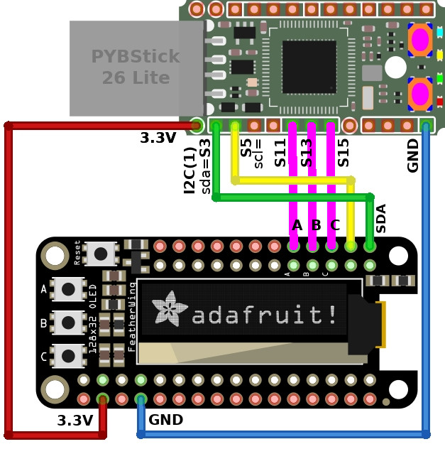

# oled-stat - Affichage de statistique sur un écran OLED

Ce projet propose d'afficher les statistiques de la carte MicroPython sur un afficheur OLED 128x32.

L'afficheur OLED utilisée est basé sur pilote SSD1306 et sera utilisé sur bus I2C (signaux SDA et SCL). Celui-ci est exploité sur de très nombreux produits comme le [Oled Feather Wing d'Adafruit](https://shop.mchobby.be/product.php?id_product=879). Ce dernier est une ressource fiable et facile à trouver.

# Brancher
Le schéma de raccordement est relativement simple:

Les boutons A, B et C sont respectivement branchés sur S11, S13, S15 (vous pouvez omettre ces raccordements s'ils ne sont pas utilisés).

# Dépendance
Pour fonctionner, ce projet requière l'installation des bibliothèques suivantes sur la carte MicroPython.

* [ssd1306](https://raw.githubusercontent.com/micropython/micropython/master/drivers/display/ssd1306.py) : Pilote SSD1306 officiel de MicroPython. L'utilisation de cette bibliothèque est décrite en détail sur [le wiki de MCHobby](https://wiki.mchobby.be/index.php?title=FEATHER-MICROPYTHON-OLED)

# Installer

Pour faire fonctionner cet exemple, il est nécessaire de copier les fichiers suivants sur la carte:

* `stat.py` : contient le script principal pour afficher les statistiques sur l'afficheur OLED.

# Ressource
* [Exploiter la bibliothèque SSD1306](https://wiki.mchobby.be/index.php?title=FEATHER-MICROPYTHON-OLED), un tutoriel MCHobby.
* [Lecture d'une image au format Portable BitMap (.pbm)](https://github.com/mchobby/esp8266-upy/tree/master/ncd-oled), github MCHobby

# Où acheter
* [PYBStick 26 lite  @ MCHobby](https://shop.mchobby.be/fr/micropython/1830-pybstick-lite-26-micropython-et-arduino-3232100018303-garatronic.html)
* [Oled Feather Wing d'Adafruit](https://shop.mchobby.be/product.php?id_product=879)
* [Gamme MicroPython chez MCHobby](https://shop.mchobby.be/fr/56-micropython)
