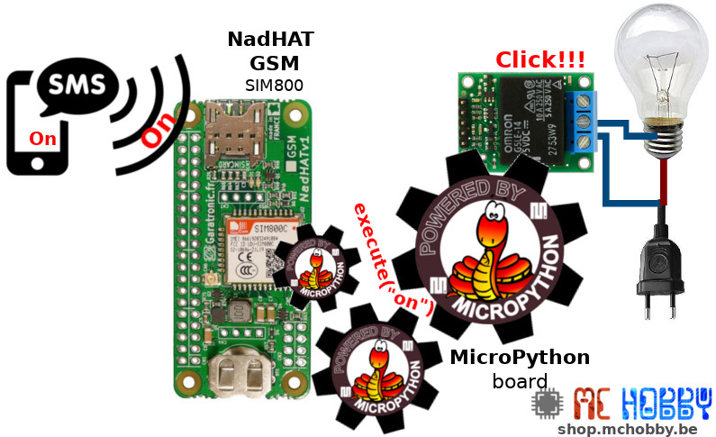
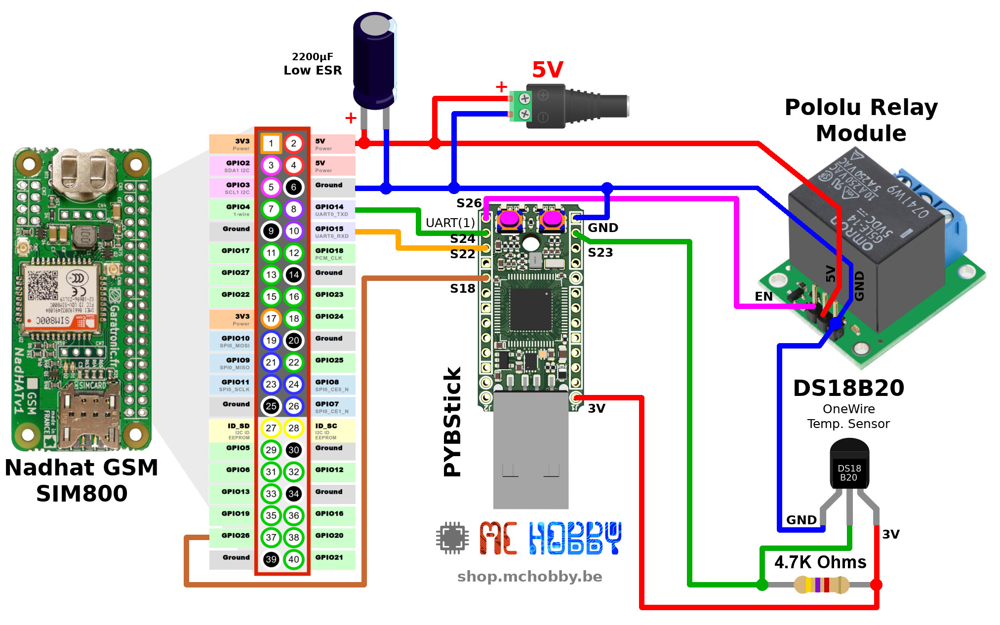
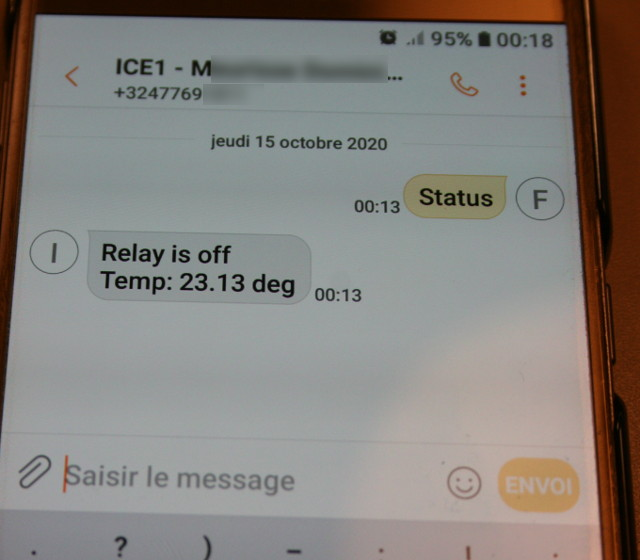
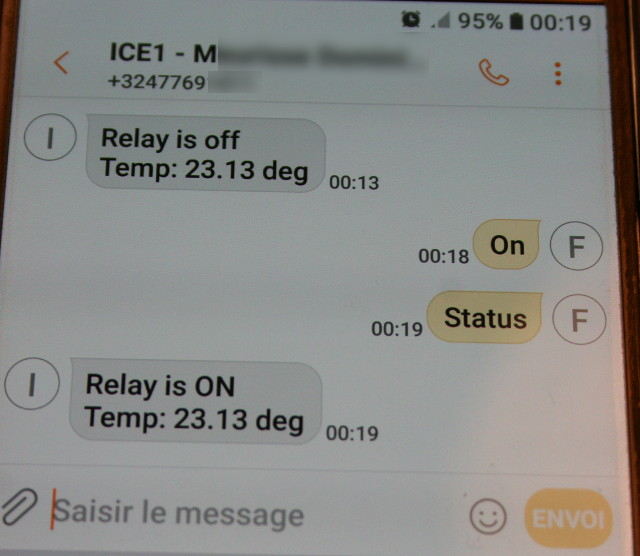
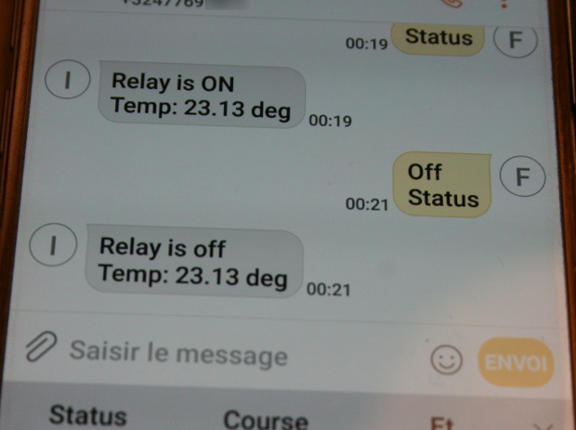

# Commander un relais par SMS

Le projet ci-dessous permet de commander un relais et relever la température à distance à l'aide de SMS (aussi appelé texto).



Une option intéressante pour commander l'activation d'une chaudière dans la seconde résidence et y relever la température.

Ce projet utilise une [carte PYBStick](https://shop.mchobby.be/fr/micropython/1844-pybstick-standard-26-micropython-et-arduino-3232100018440-garatronic.html) et une [carte NADHAT GSM SIM800](https://shop.mchobby.be/fr/pi-hats/1656-nadhat-gsm-gprs-connecteur-sim800c-v1-3232100016569-garatronic.html) (réseau 2G).

## Commandes
* __ON__ : active le relais
* __OFF__ : désactiver le relais
* __STATUS__ : repond avec un SMS indiquant le statut du relais et de la sonde de température

# Préparer la carte SIM
Si la carte SIM n'a pas encore été utilisée, il est préférable de la glisser dans un téléphone et d'effectuer un premier appel.

De nombreux opérateurs mobiles utilisent ce procédé pour activer la carte SIM sur les réseaux mobiles.

Par la suite, vous pourrez glisser la carte dans votre NADHAT GSM.

# Brancher



# Tester
## Copier les bibliothèques
Les différentes bibliothèques nécessaires sont disponibles dans l'archive [dependencies.zip](lib/dependencies.zip).

Cela concerne les fichiers:
* `ds18x20.py` : lecture de la sonde de température
* `onewire.py` : support du protocole OneWire
* `smodem.py` : [bibliothèque sim-modem (GitHub)](https://github.com/mchobby/pyboard-driver/tree/master/sim-modemshop) apportant le support du module SIM800 sous MicroPython

Les fichiers doivent être disponibles sur la carte MicroPython.

## Copier le script principal & configuration
Le script principal est composé de deux fichiers:
* `srelay.py` : script principal
* `config.py` : configuration du projet

Il est __impératif d'adapter le fichier `config.py`__:

Si vous ne le faites pas alors vous bloquerez inévitablement la carte SIM après 3 mauvaises tentatives.

``` python
# Code pin de la carte SIM. Utiliser None si non applicable
PIN_CODE = '1234'
# Numéro de téléphone maître à contacter (pas encore exploité)
MASTER_PHONE = '+3249692xxxx'
```

## Démarrage

Pour tester rapidement et facilement le projet, le plus facile est d'ouvrir une session REPL et de saisir l'instruction `import srelay` .

On peut y voir le démarrage du script et la vidange des SMS encore disponible en mémoire.

``` python
MicroPython v1.12 on 2020-05-12; PYBSTICK26_STD/PROGRAMMEZ! with STM32F411RE
Type "help()" for more information.
>>>
>>> import srelay
Activate modem
Modem initialized!
Open SMS store - attempt 0
Empty SMS store
  Drop sms 1
  Drop sms 2
Wait for SMS...
```

Ensuite, l'envoi d'un message "STATUS" fait renvoyer un message d'information par le projet.



Il est possible de constater la réception du messahe dans la session REPL
( avec indication de la réception du SMS ainsi que du message reçu).

```
Wait for SMS...
Sender : +3249692xxxx
Time   : 20/10/15 00:15:21+08
Status
----------------------------------------
```


## Exemple de On

En envoyant la commande "On", le project active le relais.

Le seconde commande "Status" permet d'interroger le projet sur son nouvel état.



Et le résultat visible dans la session REPL:

```
Sender : +3249692xxxx
Time   : 20/10/15 00:20:21+08
On
----------------------------------------
Sender : +3249692xxxx
Time   : 20/10/15 00:20:38+08
Status
----------------------------------------
```

## Exemple de Off

Il est également possible d'envoyer deux commandes en une seule opération (avec une commande par ligne).

Les commandes seront exécutées l'une après l'autre.



```
Sender : +3249692xxxx
Time   : 20/10/15 00:22:33+08
Off
Status
----------------------------------------
```

# Démarrage automatique
Pour démarrer automatiquement le script au démarrage de la carte, il suffit de
renommer le fichier `srelay.py` en `main.py`

# Ajouter des commandes

Le fichier `srelay.py` ne fait d'une centaine de ligne de code.

Pour ajouter ou modifier des commande il fait localiser la fonction `execute( sender, cmd )` et ajouter vos propres instructions.

La fonction `execute()` est appelée avec deux paramètres:
* `sender` : (str) contient le n° de téléphone de l'expéditeur (eg:'+3247769xxxx')
* `cmd` : (str) une des lignes de commandes du message. La commande est en majuscule (et espaces retirés)

Le fonctionnement est relativement simple et évident:

``` python
def execute( sender, cmd ):
	""" Just execute the various command (uppercase,striped) """
	global relay
	global m

	if cmd=='ON':
		relay.value( 1 )
	elif cmd=='OFF':
		relay.value( 0 )
	elif cmd=='STATUS':
		m.send_sms( sender, 'Relay is %s\rTemp: %5.2f deg' % ('ON' if relay.value() else 'off', get_temp()) )
	else:
		print( 'Command %s not supported!' % cmd )
		m.send_sms( sender, 'Invalid command %s !' % cmd )
```
# Support

Un problème de mise en oeuvre? postez un petit message sur [forum.mchobby.be](http://forum.mchobby.be).

# Liste d'achat

* [carte PYBStick](https://shop.mchobby.be/fr/micropython/1844-pybstick-standard-26-micropython-et-arduino-3232100018440-garatronic.html)
* [carte NADHAT GSM SIM800](https://shop.mchobby.be/fr/pi-hats/1656-nadhat-gsm-gprs-connecteur-sim800c-v1-3232100016569-garatronic.html)
* Sonde de température [DS18B20](https://shop.mchobby.be/fr/temperature/259-capteur-temperature-ds18b20-kit-extra-3232100002593.html) (ou [DS18B20 WaterProof](https://shop.mchobby.be/fr/environnemental-press-temp-hrel-gaz/151-capteur-temperature-ds18b20-etanche-extra-3232100001510.html))
* [Module relais de Pololu](https://shop.mchobby.be/fr/relais-modules/107-module-relais-3232100001077-pololu.html)
* [Adaptateur Jack](https://shop.mchobby.be/fr/alim/235-adaptateur-d-alimentation-femelle-jack-vers-bornier-3232100002357.html)
