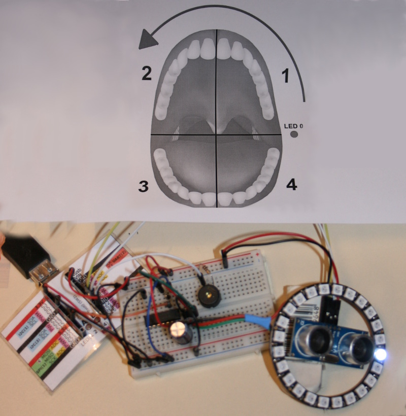
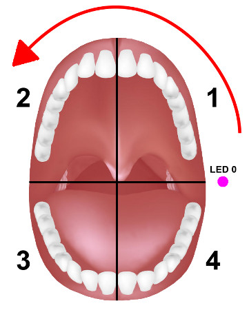

# Minuteur de brossage de dent

Le minuteur de brossage de dent est un dérivé du projet "covid-madenn-timer" présent sur ce dépôt.

Ce projet utilise un anneau NeoPixel (24 leds) avec un capteur ultrasonic et une carte MicroPython (PYBStick)



La LED allumé est utilisée pour positionner correctement l'anneau NeoPixel au montage.



Par la suite (voir plus bas), il sera possible d'éteindre cette LED de positionnement.

Ce projet peut être vu en cours de fonctionnement dans [cette Video Youtube](https://youtu.be/1S_0Lph5v0U) .

Il faudra encore lui trouver une jolie boîte.

# Principe de fonctionnement
1. Le minuteur s'active en passant la main devant le capteur.
2. Une fois en route, la roue se remplit pendant 4 seconde, le temps nécessaire pour mettre le dentifrice sur la brosse.
3. Ensuite, le décompte de 2 minutes commence, temps pendant lequels l'anneau s'éteind progressivement et les différentes sections de brossage sont indiquées (par clignotement).
4. Au bout du temps imparti, l'anneau est éteint et le buzzer signal la fin du brossage.
5. Voila, il est temps de se rincer la bouche. Le minuteur est près pour un nouveau cycle.

# Brancher
Le schéma de raccordement n'est pas trop difficile. Un adaptateur de 74AHCT125 est utilisé pour pouvoir utiliser exploiter les NeoPixels sous 5V et offrir des couleurs vives.


## montage

Le script disponible dans ce dépôt laisse la LED 0 allumée. Cela permet de positionner correctement l'anneau lors du montage.

Par la suite il suffit de mettre la ligne suivante en commentaire dans le script pour éteindre cette LED de positionnement (ligne située en fin de script):

```
    np[0] = (64,64,64) # Indique LED 0 pour assemblage
```

Qui doit donc ressembler à ceci une fois modifié

```
    # np[0] = (64,64,64) # Indique LED 0 pour assemblage
```


# Dépendance
Pour fonctionner, ce projet requière l'installation des bibliothèques suivantes sur la carte MicroPython.

* __ws2812.py__ : contrôler des NeoPixels avec le bus SPI [disponible ici (esp8266-upy GitHub)](https://github.com/mchobby/esp8266-upy/tree/master/neopixel)
* __ultrasonic.py__ : mesure de distance avec un capteur ultrason HC-SR04 [disponible ici (pyboard-a-roulette)](https://github.com/mchobby/pyboard-a-roulette/tree/master/libraries/ultrasonic)

# Installer
Pour faire fonctionner cet exemple, il est nécessaire de copier les fichiers suivants sur la carte:

* `brushing.py` : contient le script principal. Il doit être renommé `main.py` pour démarrer automatiquement à la mise sous tension de ma carte.

Il est également possible de tester le script `brushing.py` depuis une session REPL en saisissant la commande suivante:

`import  brushing`

# Liste d'achat
* [PYBStick 26 Standard](https://shop.mchobby.be/fr/micropython/1844-pybstick-standard-26-micropython-et-arduino-3232100018440-garatronic.html), [PYBStick 26 lite](https://shop.mchobby.be/fr/micropython/1830-pybstick-lite-26-micropython-et-arduino-3232100018303-garatronic.html) (ou carte [MicroPython](https://shop.mchobby.be/fr/56-micropython))
* [Anneau NeoPixel 24 LEDs](https://shop.mchobby.be/fr/neopixels-et-dotstar/405-anneau-neopixel-24-leds-rgb--3232100004054-adafruit.html)
* [Anneau NeoPixel - 24 LEDs RGB](https://shop.mchobby.be/fr/neopixels-et-dotstar/405-anneau-neopixel-24-leds-rgb--3232100004054-adafruit.html)
* [Capteur distance ultrason - HC-SR04](https://shop.mchobby.be/fr/proximite-distance/561-capteur-distance-ultrason-hc-sr04-3232100005617.html)
* [Piezo Buzzer](https://shop.mchobby.be/fr/autres-capteurs/57-piezo-buzzer-3232100000575.html)
* [74AHCT125](https://shop.mchobby.be/fr/ci/1041-74ahct125-4x-level-shifter-3v-a-5v-3232100010413.html?search_query=74ahct125&results=1) convertisseur de niveau logique
