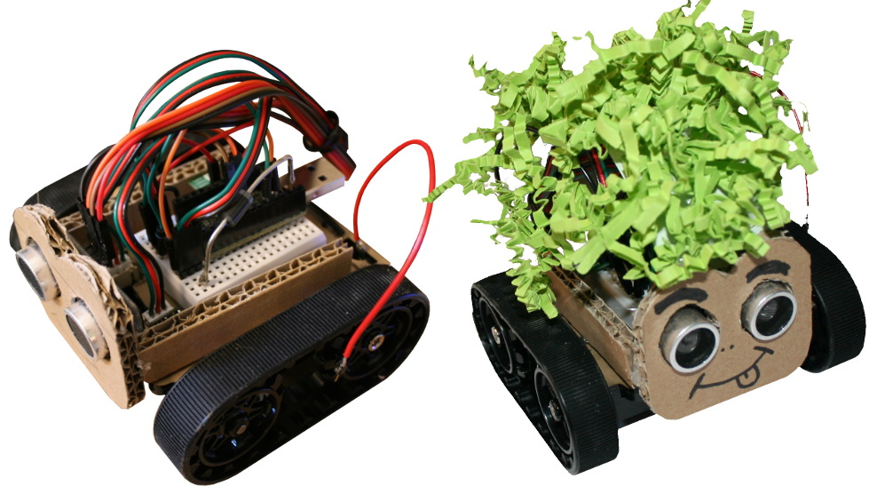
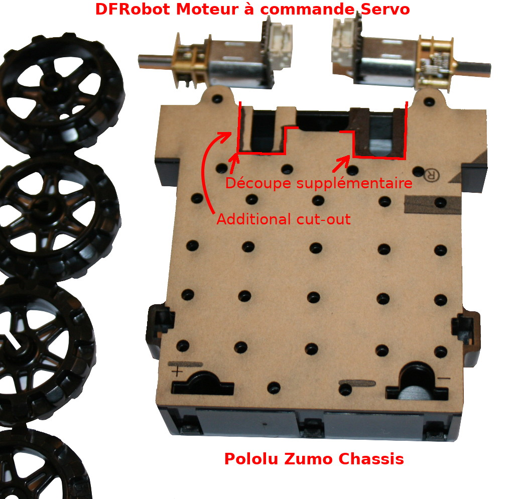
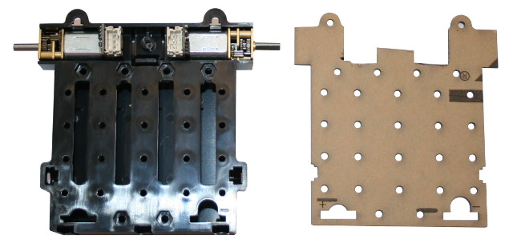
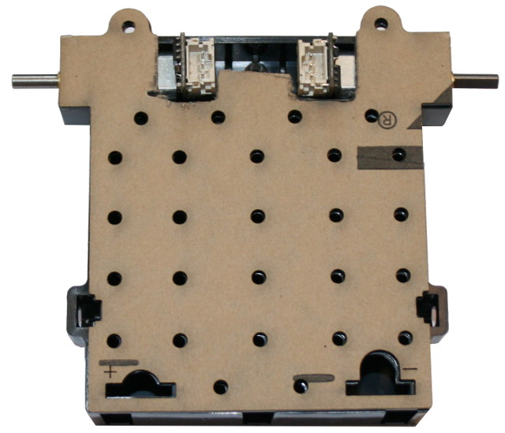
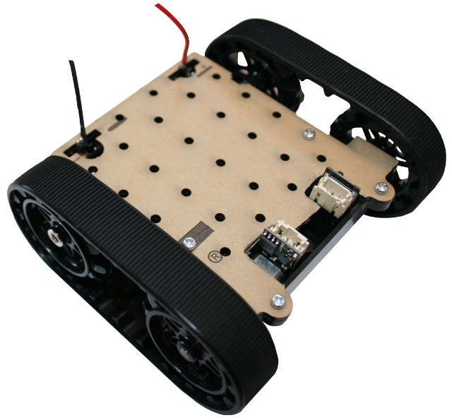
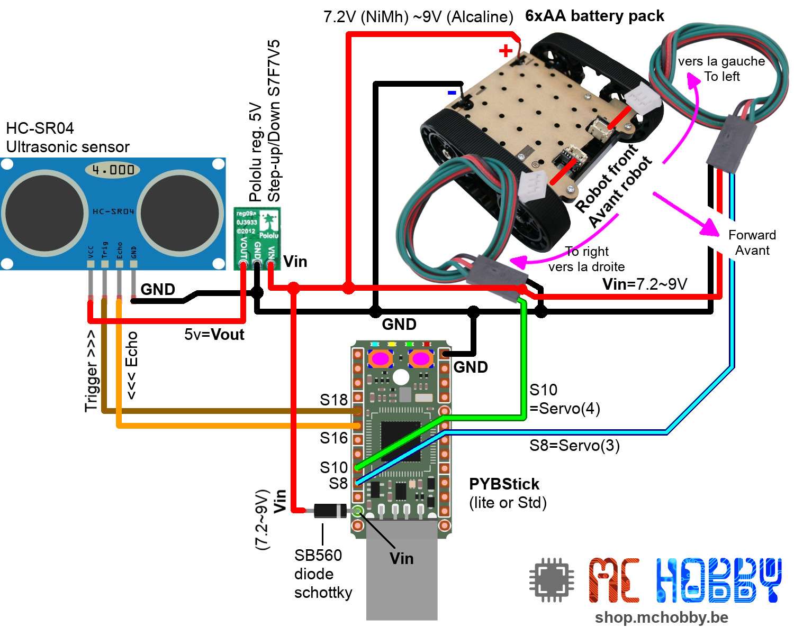

# Créer un Robot avec Zumo Châssis et moteur DFRobot

__PROJET EN COURS DE FINALISATION__

En utilisant un [châssis Zumo de Pololu](https://shop.mchobby.be/fr/prototypage-robotique-roue/447-zumo-kit-chassis-sans-moteur-3232100004474-pololu.html) avec des [moteurs continus à contrôleur servo](https://shop.mchobby.be/fr/prototypage-robotique-roue/447-zumo-kit-chassis-sans-moteur-3232100004474-pololu.html) et une [PYBStick](https://github.com/mchobby/pyboard-driver/tree/master/PYBStick) il est possible de réaliser un chouette petit robot avec très peu de connexions.

Ce projet utilisera également un [capteur ultrasonic](https://shop.mchobby.be/fr/proximite-distance/561-capteur-distance-ultrason-hc-sr04-3232100005617.html) pour détecter la présence d'objet à l'avant du robot.

Le capteur ultrasonic permet de détecter des objets sur une distance de 2cm à 4m en utilisant le même principe que la chauffe-souris.

Vous pouvez voir ce projet en fonctionnement sur [__cette vidéo YouTube__](https://youtu.be/UrhTwr0xmoI).

# Préparation

Les [moteurs continus à contrôleur servo](https://shop.mchobby.be/fr/prototypage-robotique-roue/447-zumo-kit-chassis-sans-moteur-3232100004474-pololu.html) proposés dans ce projet on la bonne taille pour être utilisé avec le châssis Zumo.

Par contre, le petit contrôleur à l'arrière du moteur, bien que très petit, reste trop gros et il faut couper un petit bout de la plaque de fixation avec un scie ou une Dremel.

Une fois les emplacements de découpés, les moteurs prennent parfaitement place dans le logement.... il ne reste plus qu'à placer finir l'assemblage du [châssis tel que recommandé dans la documentation de Pololu](https://www.pololu.com/docs/0J54/3).

A noter:
1. Qu'il est préférable de souder un fil noir/bleu sur le pole négatif (celui avec le ressort) et un fils rouge sur le pôle positif (la pastille bombée)
2. De fixer le pole Positif et négatif à l'aide de colle chaude, double face, colle. Ces éléments sont prévus pour être soudés sur une carte au dessus du boîtier.

# Brancher

Voici quelques explications sur le montage:
* Pour commencer, le bloc pile du Zumo permet d'obtenir une tension nominale de 6V à partir de piles Alcaline. Si vous utilisez des piles rechargeables (Ni-Mh) alors la tension nominale sera de 5V. Attention: cette tension des destinée à chuter progressivement l'utilisation du robot.
* Le PYBStick est alimenté sur sa broche VIN depuis le bloc pile du châssis Zumo. La  [diode Schottky SB560](https://shop.mchobby.be/fr/electronique-divers/1508-5-diodes-sb560-schottky-60v-5a-670mv-3232100015081.html) est présente pour éviter que le courant du port USB (lorsque branché sur l'ordinateur) ne se déverse dans le bloc pile (si la tension chute sous 5V). A noter que le port USB est déjà protégé par sa propre diode Schottky.
* Un régulateur DC/DC [S7V7F5 de Pololu](https://shop.mchobby.be/fr/regulateurs/463-regul-5v-500ma-step-updown-s7v7f5-3232100004634-pololu.html) est utilisé pour produire une tension de 5V à partir du bloc pile. Cette tension est nécessaire au fonctionnement du capteur ultrasonique HC-SR04.
* Les signaux Echo et Trigger du [capteur UltraSonique HC-SR04](https://shop.mchobby.be/fr/proximite-distance/561-capteur-distance-ultrason-hc-sr04-3232100005617.html) sont branchés sur la PYBStick. Le signal Echo produit par le capteur est en logique 5V alors que la PYBStick est en logique 3.3V. Par chance, la microcontrôleur de la PYBStick est tolérant 5V sur presque toutes ces broches. Nous pouvons donc brancher le signal Echo sur S16 sans danger. __Attention toutefois à ne pas abuser de la tolérance 5V__, cela reste une exception dans le monde des microcontrôleurs et non une règle d'usage.

# Dépendance
Pour fonctionner, ce projet requière l'installation des bibliothèques suivantes sur la carte MicroPython.

* `ultrasonic.py` : Utilisation du capteur HC-SR04 avec MicroPython [disponible ici sur le GitHub de MCHobby](https://github.com/mchobby/pyboard-a-roulette/tree/master/libraries/ultrasonic) avec un [tutoriel dédicacé sur le Wiki de MCHobby](https://wiki.mchobby.be/index.php?title=MicroPython-HC-SR04).
* `servozumo.py` : disponible dans le sous-répertoire `lib`, cette bibliothèque contient la classe `ServoZumo` qui facilite le pilotage des moteurs.

# Installer
Pour faire fonctionner cet exemple, il est nécessaire de copier les fichiers suivants sur la carte (en plus des bibliothèques nécessaires):

* `explorer.py` : contient le script principal qui déplace le robot, détecte les objets et change de direction.

Le script `explorer.py` peut être renommé `main.py` pour démarrer automatiquement à la mise sous tension (ou Reset) de la carte.

Après avoir débranché la PYBStick de votre ordinateur, le programme peut être démarré en réalisant un cycle d'alimentation sur la Pyboard (en retirant et replaçant une pile).

Note: Il est également possible de faire un `import explorer` depuis une session REPL. Cela permet de  vérifier que toutes les dépendances nécessaires sont bien installées sur la carte.

# Mise en route

Après avoir débranché la PYBStick de votre ordinateur, le programme peut être démarré en réalisant un cycle d'alimentation sur la Pyboard (en retirant et replaçant une pile).

Une fois en route, le script:
1. Attend que l'on presse le bouton utilisateur A (celui côté masse)
2. Effectue un décompte de 10 secondes (avec clignotement de la LED rouge) avant de démarrer le coeur du script.
3. Le script est arrêté (et les moteurs aussi) en pressant à nouveau le bouton utilisateur.

Durant le fonctionnement du script, le robot avant en marche avant jusqu'à la détection d'un obstacle à moins de 20cm.

Dès l'obstacle détecté, le robot tourne à droite ou à gauche (au hasard) et pendant un temps choisi au hasard entre 400 et 1500ms (0.4 à 1.5s). Opération répétée aussi longtemps qu'un obstacle est détecté.

En l'absence d'obstacle, le robot se remet en marche.

# Liste d'achat
* 1x [châssis Zumo de Pololu](https://shop.mchobby.be/fr/prototypage-robotique-roue/447-zumo-kit-chassis-sans-moteur-3232100004474-pololu.html)
* 2x [moteurs continus à contrôleur servo](https://shop.mchobby.be/fr/prototypage-robotique-roue/447-zumo-kit-chassis-sans-moteur-3232100004474-pololu.html)
* 1x [PYBStick Standard](https://shop.mchobby.be/fr/micropython/1844-pybstick-lite-26-micropython-et-arduino-3232100018440-garatronic.html) ou [PYBStick Lite](https://shop.mchobby.be/fr/micropython/1830-pybstick-lite-26-micropython-et-arduino-3232100018303-garatronic.html)
* 1x [capteur ultrasonic HC-SR04](https://shop.mchobby.be/fr/proximite-distance/561-capteur-distance-ultrason-hc-sr04-3232100005617.html)
* 1x [Diode Schottky SB560](https://shop.mchobby.be/fr/electronique-divers/1508-5-diodes-sb560-schottky-60v-5a-670mv-3232100015081.html)
* 1x [Régul. 5V 500mA, Step Up/Down, S7V7F5](https://shop.mchobby.be/fr/regulateurs/463-regul-5v-500ma-step-updown-s7v7f5-3232100004634-pololu.html)
